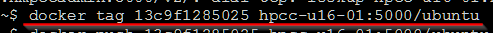
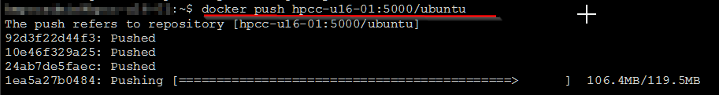
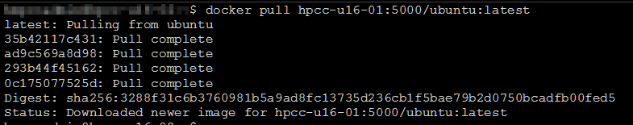

## Installation
To access our locally hosted container registry, make the following configuration changes to your linux client machine.

**STEP 1**:  Depending on the distribution of Docker that you are using the daemon.json configuration file can be found 
in either: /etc/docker or /var/lib/docker. If not, then use the one contained in the repo as a template.

```bash
# cp daemon.json /etc/docker/daemon.json
```

**STEP 2**: Now to apply the configuration restart docker by running the following commands as root.

```bash
# systemctl daemon-reload && systemctl restart docker
```

## How To Use
Now that your machine is configured, you are now ready to push and pull images from the registry.

To push images hosted locally, first tag it correct remote repository using the following form:
	docker tag <container image id> registry_server_name_or_ip:port/your_image_name:tag_if_you_got_one

```bash
$ docker tag 13c9f1285025 docker-registry:5000/busybox
```




With the image now tagged you are ready to push using the following syntax:
	docker push registry_server_name_or_ip:port/your_image_name:tag_if_you_got_one

```bash
$ docker push docker-registry:5000/busybox:1.0
```



To pull images from the repo just do the following

```bash
$ docker pull docker-registry:port/image_name:tag  #if no tag, latest will get pulled. 
```


